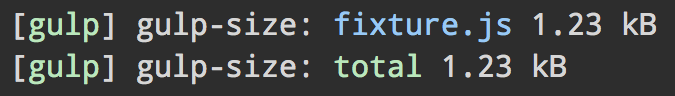

# gulp-size

> Display the size of your project



Logs out the total size of files in the stream and optionally the individual file-sizes.

## Install

```sh
npm install --save-dev gulp-size
```

## Usage

```js
import gulp from 'gulp';
import size from 'gulp-size';

export default () => (
	gulp.src('fixture.js')
		.pipe(size())
		.pipe(gulp.dest('dist'))
);
```

## API

### size(options?)

#### options

Type: `object`

##### title

Type: `string`\
Default: `''`

Give it a title so it's possible to distinguish the output of multiple instances logging at once.

##### gzip

Type: `boolean`\
Default: `false`

Displays the gzipped size.

##### brotli

Type: `boolean`\
Default: `false`

Displays the brotli compressed size.

##### uncompressed

Type: `boolean`\
Default: `false` if either of gzip or brotli is `true`, otherwise `true`

Displays the uncompressed size.

##### pretty

Type: `boolean`\
Default: `true`

Displays prettified size: `1337 B` → `1.34 kB`.

##### showFiles

Type: `boolean`\
Default: `false`

Displays the size of every file instead of just the total size.

##### showTotal

Type: `boolean`\
Default: `true`

Displays the total of all files.

### size.size

Type: `number`\
Example: `12423000`

The total size of all files in bytes.

### size.prettySize

Type: `string`\
Example: `14 kB`

Prettified version of `.size`.

#### Example

You could, for example, use this to report the total project size with [`gulp-notify`](https://github.com/mikaelbr/gulp-notify):

```js
import gulp from 'gulp';
import size from 'gulp-size';
import notify from 'gulp-notify';

export default () => (

exports.default = () => {
	const sizeInstance = size();

	return gulp.src('fixture.js')
		.pipe(sizeInstance)
		.pipe(gulp.dest('dist'))
		.pipe(notify({
			onLast: true,
			message: () => `Total size ${sizeInstance.prettySize}`
		}));
};
```
